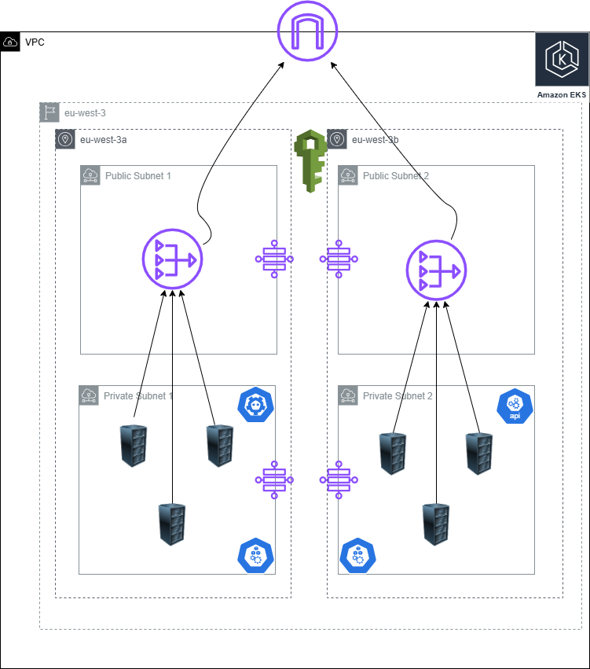

# Infra Structure

## Details
This terraform code : 
 - VPC in a region (eu-west-3)
 - 2 Public subnets spanned on 2 Availability zones (eu-west-3a and eu-west-3b)
 - 2 Private subnets spanned on 2 Availability zones (eu-west-3a and eu-west-3b)
 - Internet Gateway
 - 2 Nat gateways each on a public subnet 
 - Route tables for public subnets that redirect request to internet gateway
 - Route tables for private subnets that redirect requests to NAT gateway
 - EKS cluster that spans all subnet (public and private ones)
 - Node group deployed on private subnets
 - IAM roles to Node group and EKS Cluster